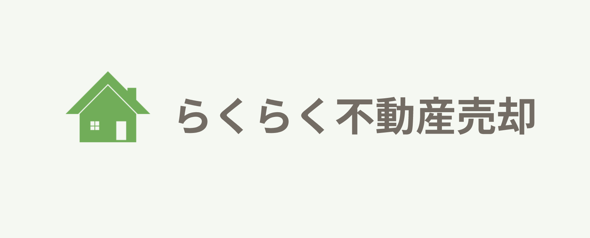

# らくらく不動産売却

### 9/6 ~ 9/17 , 2021

メインの Rails アプリケーション

## 環境構築

``` bash
docker-compose build
docker-compose run --rm app yarn install --check-files
docker-compose run --rm app bin/setup
```

## サーバー起動

``` bash
docker-compose up
open http://localhost:13000
```

## テストの実行

``` bash
docker-compose run --rm app bin/rails test
```

## Rubocop の実行

``` bash
docker-compose run --rm app rubocop
```

## サーバへのデプロイ

0. (初回のみ) `aws ecs run-task --cluster internship-sep2021-2 --task-definition internship-sep2021-2-db-create --launch-type FARGATE --network-configuration '{"awsvpcConfiguration":{"subnets":["subnet-040c56b871bf8abf1","subnet-06f1ca9c09c38319b","subnet-0a12084a432623a16"],"securityGroups": ["sg-080111b219d2529dd"],"assignPublicIp":"ENABLED"}}' --count 1` で `rails db:create` を本番環境のDBに適用し、この Rails アプリが使用する MySQL のデータベースを作成する。
1. [GitHub Actions タブの deploy ワークフロー](https://github.com/speee/hr-eng-internship-2021-2nd-team-2/actions) に移動
2. `This workflow has a workflow_dispatch event trigger.` の右側にある `Run Workflow` ボタンをクリック
3. `Use workflow from` のセレクトボックスからデプロイ対象のブランチを選択
4. `Run Workflow` ボタンをクリック

## ステージング
https://sep2021-2.intern.speee.in

## 開発方針
<b>9/12更新</b>
このままでは当初の見積もり通りの開発が困難と判断したため、テストは基本書かずに進める。

今後の進捗管理にはGithub Projectsを使用する。
毎日開発前にその日やる開発（イシュー）とその担当を決め、Today's tasks に移動させて始める。
その後のイシュー進捗状況は担当している人が各自でカードを移動させる。

その後のPRのマージには他のチームメンバーもしくはメンター福田さんのコードレビューを必須とする。

コードレビューは分担で行う。この際見る点としては、

<li>コーディングスタイルはチーム内のルールに沿っているか</li>
<li>余分なコード（Print等）が残っていないか</li>
<li>他の機能に影響（バグ等）していないか</li>
<li>クラスやメソッドは適切に分離されているか</li>

を意識する。

## rubocop

```
rubocop -A
```
上記コマンドでフォーマットを実行できる。

## rake task(Prefecture table,city tableはこれ叩かないと作成されない)

```
rake import:prefecture
rake import:city
```
